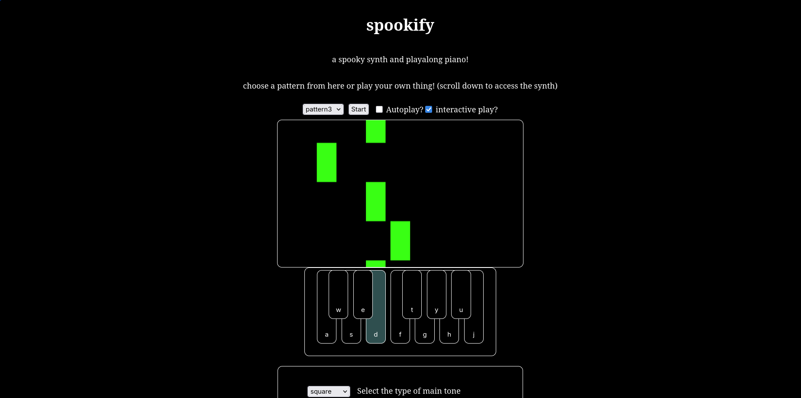

# spookify

a spooky synth with a playalong piano!

spookify is a web based synth that plays spooky tunes, allows you to adjust their settings, and play different tunes using a falling blocks player. it has a bunch of modes for playing preset spooky patterns, like autoplay, where the program plays the tune on its own, interactive play where the program stops for you to play along, normal play where you can look at the notes and play , and just a normal synth where you can play anything you want! 

i always wanted to make one of my own tools that played like those falling block piano videos we see on youtube, where you have to press the key at the exact type the neon block hits your keyboard. and looking at the 3am spooky theme, i added a spooky synth to it!

built using vanilla html css and js. uses webaudio for the synth and note sounds, a canvas with animation for the falling blocks.

just head over to [this page](https://shlokdee.github.io/spookify) to try it out! mess around with the synth types and values, just listen to the preset tunes, or play along with them, interactively or at your own pace, or just enjoy the spooky vibes xD